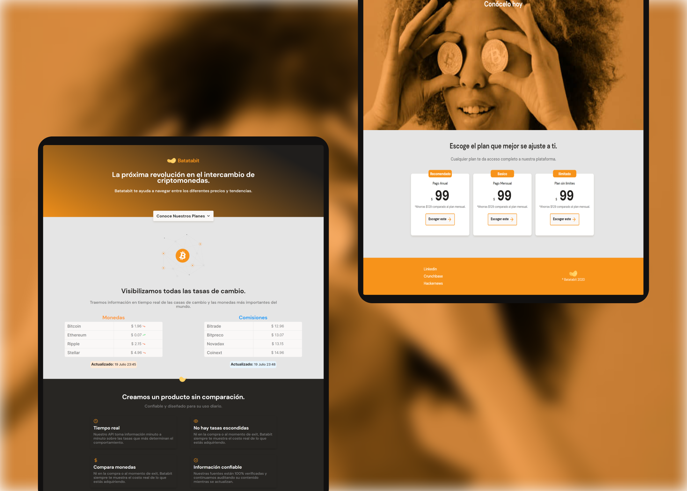

# Batata Bit

It is a landing page about cryptocurrencies, built in CSS and HTML.
## Preview 🖼

## Demo 💻

If you want to see the demo, you can visit this link. **[Demo of the project](https://mxrold.github.io/batata-bit)**

## Pre requirements 📋

To run this project or you want to modify something, you needed the next points
- A browser.
- A code editor as Visual Studio Code, Atom, Sublime Text, among others.

## Installation - How to clone 🚀

To install and run this project you can to do with __git clone__

- With HTTPS
~~~
https://github.com/mxrold/batata-bit.git
~~~
- With SSH
~~~
git@github.com:mxrold/batata-bit.git
~~~

_Not sure how to clone a project? **[Check this](https://github.com/mxrold/how-to-clone-a-repository-in-github/blob/main/README.md)**_

## Building with 🛠️

- HTML
- CSS (Grid and Flexbox)

### Notes
This is a project from **[Platzi's course on mobile-first](https://platzi.com/clases/mobile-first/)**.
